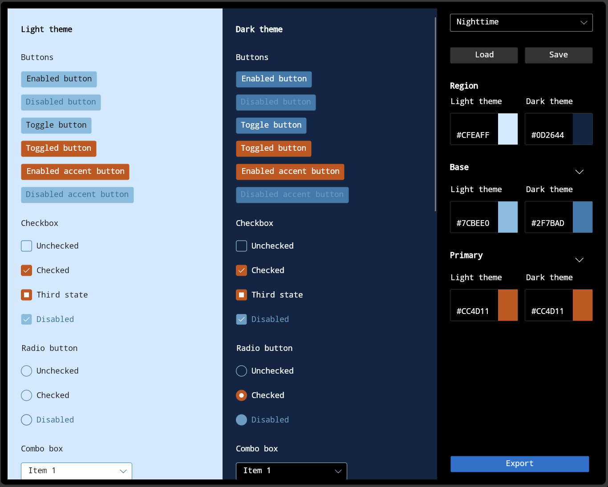

Fluent XAML Theme Editor 
===

This repo contains the full solution and source code to the Fluent XAML Theme Editor - a tool that helps demonstrate the flexibility of the [Fluent Design System](https://www.microsoft.com/design/fluent/) as well as supports the app development process by generating XAML markup for our ResourceDictionary framework used in Avalonia applications.

It is a fork of [UWP Fluent XAML Theme Editor](https://github.com/microsoft/fluent-xaml-theme-editor/tree/97321946cf1f03128c98251f03da62b7334671af) by Microsoft, modified to work with Avalonia.

Browser version is accessible from https://theme.xaml.live/



How to use the tool
---
With the preview build, you can select three major colors for both the Light and Dark themes in the right-hand properties view labeled “Color Dictionary”.


 - **Region** – The background that all the controls sit on, which is a separate resource that does not exist in our framework.
 - **Base** – Represents all our controls’ backplates and their temporary state visuals like hover or press. In general, Base should be in contrast with the background (or Region color) of your theme and with black text (if in Light theme) and white text (if in Dark theme).
 - **Primary** – This is essentially the Accent color and should contrast with mainly white text. It is also used in more choice locations to show alternate rest states for toggled controls like list selection, checkbox or radiobutton checked states, slider fill values, and other control parts that need to be shown as different from their default rest state once interacted with.
 
Refining the colors
---
In addition to the three major colors for each theme, you can also expand any one of the major colors to see a list of minor colors that change the look of only certain control parts - this basically allows you to get more detailed with your color choices for states.


To access the detailed view of colors, simply click the chevron next to the major color button swatches.

Creating, saving and loading presets
---
The editor will ship with some presets for you to look at to get an idea of what a theme looks like in the app. The preset dropdown is located at the top of the Color Dictionary properties panel.

When you first boot up it will always be set to Default – which is the Light and Dark theme styling default for all our controls. You can select different themes like Lavender and Nighttime to get an idea of how the tool will theme our controls.

Once you’re ready to start making your own theme, just start editing the colors! Once you’ve started tweaking them, you’ll notice that the Presets ComboBox goes from the name of the preset to “Custom”:

This means that you’ve started a new temporary theme that’s “Custom.” Any changes you make will not affect any of the other Presets in that box.

 - Once you’re satisfied with the changes you’ve made, simply click the “Save” button and browse to your desired save point.
 - Similarly, you can open your saved JSON theme by clicking the “Load” button and browsing to your saved theme’s file location.
 
Checking contrast ratio
---
The last part of the theme editor is probably one of the most important parts of creating your theme, and that is to make sure that in either respective theme you are contrast compliant. The tool provides you with a small list of contrast information on the left-hand side of the color selection window when choosing your color.


In this window you can see your contrast with the most prevalent text color in the theme that you’re choosing to edit, in the above case black text because you are editing a Light theme color value.

When you pick a color that falls below the standard contrast ratio of **4.5:1**, you’ll be alerted with red text next to your contrast value.


You can learn more about [contrast ratios and their importance here](https://docs.microsoft.com/en-us/windows/uwp/design/accessibility/accessible-text-requirements).

Exporting and using your theme in a Avalonia app
---
Once you’ve themed everything, you’ll want to use it in your app! To do that you’ll need to click the “Export” button at the bottom of the Color Dictionary properties panel.


That button will open a popup window with a generic FluentTheme definition that contains your palette.

Once you’re ready to use it in your app, click the “Copy to Clipboard” button in the lower right corner and go to Avalonia App.axaml file.

Normally, your App.axaml file will have FluentTheme defined already. It uses build-in dark and light palettes.
Note, your App.axaml might contain additional lines like DataGrid or ColorPicker include or more. 
To update FluentTheme palettes we only need to update FluentTheme node. 
```xaml
<Application xmlns="https://github.com/avaloniaui"
             xmlns:x="http://schemas.microsoft.com/winfx/2006/xaml"
             xmlns:local="using:AvaloniaTest"
             x:Class="AvaloniaTest.App"
             RequestedThemeVariant="Default">
    <Application.Styles>
        <FluentTheme />
    </Application.Styles>
</Application>
```

Now you can paste the exported theme code from the editor replacing default `<FluentTheme />`:
```xaml
<Application xmlns="https://github.com/avaloniaui"
             xmlns:x="http://schemas.microsoft.com/winfx/2006/xaml"
             xmlns:local="using:AvaloniaTest"
             x:Class="AvaloniaTest.App"
             RequestedThemeVariant="Default">
    <Application.Styles>
        <FluentTheme>
            <FluentTheme.Palettes>
                <ColorPaletteResources x:Key="Light" Accent="#ffcc4d11" AltHigh="White" AltLow="White" AltMedium="White" AltMediumHigh="White" AltMediumLow="White" BaseHigh="Black" BaseLow="#ff7cbee0" BaseMedium="#ff3282a8" BaseMediumHigh="#ff005a83" BaseMediumLow="#ff196e96" ChromeAltLow="#ff005a83" ChromeBlackHigh="Black" ChromeBlackLow="#ff7cbee0" ChromeBlackMedium="#ff005a83" ChromeBlackMediumLow="#ff3282a8" ChromeDisabledHigh="#ff7cbee0" ChromeDisabledLow="#ff3282a8" ChromeGray="#ff196e96" ChromeHigh="#ff7cbee0" ChromeLow="#ffc1e9fe" ChromeMedium="#ffb3e0f8" ChromeMediumLow="#ffc1e9fe" ChromeWhite="White" ListLow="#ffb3e0f8" ListMedium="#ff7cbee0" RegionColor="#ffcfeaff" />
                <ColorPaletteResources x:Key="Dark" Accent="#ffcc4d11" AltHigh="Black" AltLow="Black" AltMedium="Black" AltMediumHigh="Black" AltMediumLow="Black" BaseHigh="White" BaseLow="#ff2f7bad" BaseMedium="#ff8dbfdf" BaseMediumHigh="#ffa5d0ec" BaseMediumLow="#ff5e9dc6" ChromeAltLow="#ffa5d0ec" ChromeBlackHigh="Black" ChromeBlackLow="#ffa5d0ec" ChromeBlackMedium="Black" ChromeBlackMediumLow="Black" ChromeDisabledHigh="#ff2f7bad" ChromeDisabledLow="#ff8dbfdf" ChromeGray="#ff76aed3" ChromeHigh="#ff76aed3" ChromeLow="#ff093b73" ChromeMedium="#ff134b82" ChromeMediumLow="#ff266b9f" ChromeWhite="White" ListLow="#ff134b82" ListMedium="#ff2f7bad" RegionColor="#ff0d2644" />
            </FluentTheme.Palettes>
        </FluentTheme>
    </Application.Styles>
</Application>
```

Once that’s in, you’re done! Your theme colors will now be pervasive across your app or page depending.
